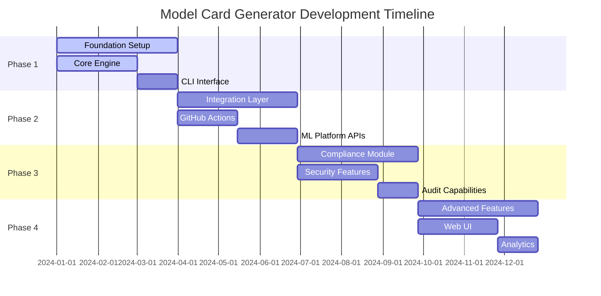

# Project Charter
## Model Card as Code Generator

### Executive Summary

The Model Card as Code Generator project aims to revolutionize machine learning model documentation by providing automated, standardized, and compliance-ready model cards that integrate seamlessly into CI/CD pipelines.

### Project Scope

#### In Scope
- Automated model card generation from ML artifacts
- Support for multiple model card standards (Hugging Face, Google, EU CRA)
- CI/CD pipeline integration via CLI and GitHub Actions
- Regulatory compliance validation and reporting
- Drift detection and automated updates
- Integration with major ML platforms (MLflow, Weights & Biases, DVC)

#### Out of Scope
- Model training or inference capabilities
- Data preprocessing or feature engineering
- Model deployment infrastructure
- Real-time model monitoring beyond card updates

### Problem Statement

Machine learning teams face significant challenges in creating and maintaining comprehensive model documentation:

1. **Manual Documentation Burden**: Creating model cards is time-consuming and error-prone
2. **Inconsistent Standards**: Different formats and requirements across organizations
3. **Regulatory Compliance**: Increasing requirements for ML transparency and accountability
4. **Documentation Drift**: Model cards become outdated as models evolve
5. **Integration Gaps**: Poor integration between ML workflows and documentation processes

### Success Criteria

#### Primary Objectives
1. **Automation Rate**: 90%+ of model card content generated automatically
2. **Compliance Coverage**: Support for GDPR, EU AI Act, and other major frameworks
3. **Integration Breadth**: Compatible with 5+ major ML platforms
4. **User Adoption**: 1000+ active users within 12 months
5. **Time Savings**: 80%+ reduction in documentation time

#### Secondary Objectives
1. **Quality Score**: 95%+ accuracy in generated content
2. **Performance**: Generate standard cards in <30 seconds
3. **Community Growth**: 100+ external contributions
4. **Enterprise Adoption**: 10+ enterprise customers

### Stakeholder Analysis

#### Primary Stakeholders
- **ML Engineers**: Primary users needing efficient documentation
- **Data Scientists**: Contributors of model evaluation data
- **Compliance Officers**: Validators of regulatory requirements
- **DevOps Teams**: Integrators of tooling into CI/CD pipelines

#### Secondary Stakeholders
- **Product Managers**: Beneficiaries of transparent model documentation
- **Legal Teams**: Advisors on compliance requirements
- **Open Source Community**: Contributors and users
- **Enterprise Customers**: Commercial users with specific needs

### Project Deliverables

#### Phase 1: Foundation (Months 1-3)
- [ ] Core generation engine with basic templates
- [ ] CLI interface with essential commands
- [ ] Hugging Face format support
- [ ] Basic validation framework
- [ ] Documentation and examples

#### Phase 2: Integration (Months 4-6)
- [ ] GitHub Actions integration
- [ ] MLflow and Weights & Biases connectors
- [ ] Google Model Cards format support
- [ ] Drift detection capabilities
- [ ] Performance optimizations

#### Phase 3: Compliance (Months 7-9)
- [ ] EU CRA format support
- [ ] GDPR compliance validation
- [ ] Advanced security features
- [ ] Audit trail functionality
- [ ] Enterprise security enhancements

#### Phase 4: Scale (Months 10-12)
- [ ] Advanced analytics and insights
- [ ] Web-based UI for card editing
- [ ] Additional ML platform integrations
- [ ] Internationalization support
- [ ] Community ecosystem development

### Resource Requirements

#### Development Team
- **Technical Lead**: Architecture and complex feature development
- **Senior Developer**: Core feature implementation
- **Developer**: Testing, documentation, and integrations
- **DevOps Engineer**: CI/CD, deployment, and infrastructure
- **UX Designer**: User interface and experience design (Part-time)

#### Technology Stack
- **Backend**: Python 3.9+, Click/Typer, Jinja2, Pydantic
- **Testing**: Pytest, Hypothesis, factory-boy
- **CI/CD**: GitHub Actions, Docker, PyPI
- **Documentation**: MkDocs, Sphinx
- **Monitoring**: Prometheus, structured logging

#### Infrastructure
- **Development**: GitHub repository with Actions
- **Testing**: Automated test suites and quality gates
- **Distribution**: PyPI for packages, Docker Hub for containers
- **Documentation**: GitHub Pages for docs hosting
- **Monitoring**: Application and usage metrics

### Risk Assessment

#### High Risk
1. **Regulatory Changes**: Evolving compliance requirements may require rapid adaptation
   - *Mitigation*: Modular architecture supporting pluggable compliance modules
2. **Platform API Changes**: ML platform API modifications could break integrations
   - *Mitigation*: Abstraction layers and comprehensive API testing

#### Medium Risk
1. **Performance Issues**: Large model data may cause generation delays
   - *Mitigation*: Streaming processing and caching strategies
2. **Security Vulnerabilities**: Handling sensitive model data requires robust security
   - *Mitigation*: Security-first design and regular security audits

#### Low Risk
1. **Community Adoption**: Slower than expected user growth
   - *Mitigation*: Active community engagement and comprehensive documentation
2. **Competition**: Similar tools may emerge in the market
   - *Mitigation*: Focus on unique value proposition and rapid feature development

### Quality Assurance

#### Code Quality Standards
- **Test Coverage**: Minimum 80% code coverage
- **Type Safety**: Full type annotation coverage
- **Code Style**: Automated formatting with Black and isort
- **Security**: Regular vulnerability scanning with Bandit and Safety
- **Performance**: Benchmarking and performance regression testing

#### Review Process
- **Code Reviews**: All changes require peer review
- **Architecture Reviews**: Significant changes require architectural review
- **Security Reviews**: Security-sensitive changes require security review
- **Documentation Reviews**: All public APIs must have comprehensive documentation

### Communication Plan

#### Internal Communication
- **Daily Standups**: Team coordination and progress updates
- **Weekly Reviews**: Progress against milestones and risk assessment
- **Monthly Retrospectives**: Process improvement and team feedback
- **Quarterly Planning**: Strategic direction and priority adjustment

#### External Communication
- **Release Notes**: Detailed changelog for each release
- **Blog Posts**: Feature announcements and technical insights
- **Conference Talks**: Community engagement and thought leadership
- **User Feedback**: Regular surveys and feedback collection

### Success Metrics

#### Development Metrics
- **Velocity**: Story points completed per sprint
- **Quality**: Bug detection rate and resolution time
- **Technical Debt**: Code complexity and maintainability scores
- **Security**: Vulnerability count and resolution time

#### User Metrics
- **Adoption**: Monthly active users and installation counts
- **Engagement**: Feature usage and user retention rates
- **Satisfaction**: User survey scores and support ticket volume
- **Performance**: Generation time and error rates

#### Business Metrics
- **Community Growth**: Contributors, stars, and forks
- **Enterprise Interest**: Trial requests and commercial inquiries
- **Market Position**: Comparison with competitive solutions
- **Revenue Impact**: Cost savings and efficiency gains

### Project Timeline

### Approval and Sign-off

This project charter represents the agreed-upon scope, objectives, and approach for the Model Card as Code Generator project. Changes to this charter require approval from the project sponsor and key stakeholders.

**Project Sponsor**: Terragon Labs Leadership  
**Technical Lead**: [Name]  
**Product Owner**: [Name]  
**Date**: [Date]  

**Approved by**:
- [ ] Technical Lead
- [ ] Product Owner
- [ ] Project Sponsor
- [ ] Compliance Officer

---

*This charter will be reviewed quarterly and updated as needed to reflect changing requirements and priorities.*