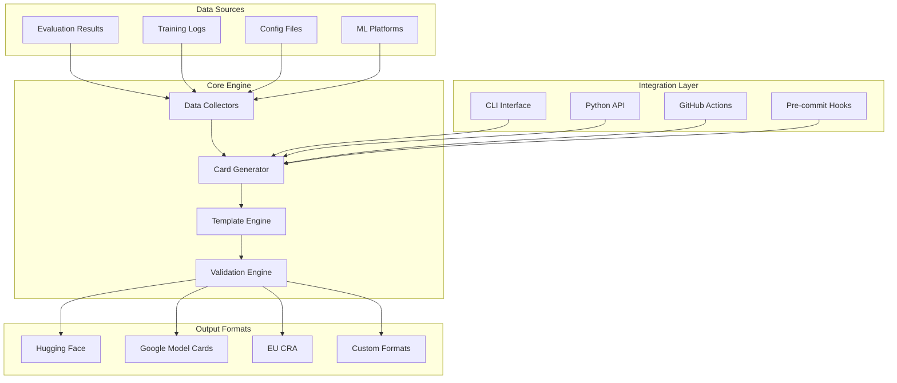
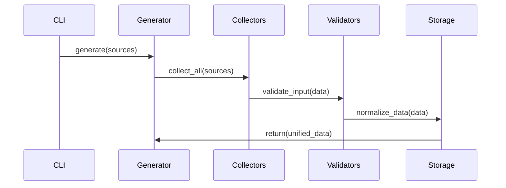
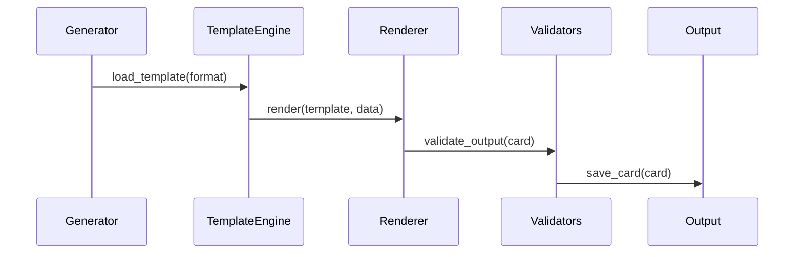
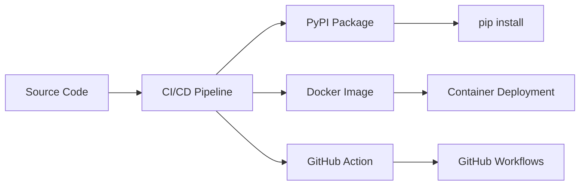

# ModelCard Generator - System Architecture

## Overview

The ModelCard Generator is a production-ready MLOps tool designed for automated generation of ML model documentation that satisfies regulatory compliance requirements (EU CRA, GDPR, EU AI Act). The system implements a layered architecture with advanced resilience patterns, intelligent caching, and distributed processing capabilities.

## High-Level Architecture

```
┌─────────────────────────────────────────────────────────────────┐
│                        Client Layer                             │
├─────────────────────────────────────────────────────────────────┤
│  CLI Interface  │  Web API  │  Python SDK  │  GitHub Actions   │
└─────────────────────────────────────────────────────────────────┘
                                   │
┌─────────────────────────────────────────────────────────────────┐
│                      Application Layer                         │
├─────────────────────────────────────────────────────────────────┤
│           Enhanced ModelCard Generator                          │
│  ┌─────────────────┐  ┌─────────────────┐  ┌─────────────────┐ │
│  │   Resilience    │  │   Rate Limiter  │  │   Security      │ │
│  │   Patterns      │  │   & Throttling  │  │   Scanner       │ │
│  └─────────────────┘  └─────────────────┘  └─────────────────┘ │
└─────────────────────────────────────────────────────────────────┘
                                   │
┌─────────────────────────────────────────────────────────────────┐
│                       Service Layer                            │
├─────────────────────────────────────────────────────────────────┤
│  ┌─────────────────┐  ┌─────────────────┐  ┌─────────────────┐ │
│  │  Distributed    │  │   Intelligent   │  │   Enhanced      │ │
│  │  Processing     │  │     Cache       │  │   Monitoring    │ │
│  │     Queue       │  │    System       │  │    & Metrics    │ │
│  └─────────────────┘  └─────────────────┘  └─────────────────┘ │
└─────────────────────────────────────────────────────────────────┘
                                   │
┌─────────────────────────────────────────────────────────────────┐
│                       Core Layer                               │
├─────────────────────────────────────────────────────────────────┤
│  Generator │ Validator │ Templates │ Formats │ Drift Detection │
└─────────────────────────────────────────────────────────────────┘
                                   │
┌─────────────────────────────────────────────────────────────────┐
│                    Infrastructure Layer                        │
├─────────────────────────────────────────────────────────────────┤
│   Redis    │  File System  │  External APIs  │   Monitoring   │
│  (Queue)   │   (Storage)    │   (Integrations) │   (Metrics)   │
└─────────────────────────────────────────────────────────────────┘
```

## System Overview

The ModelCard Generator has evolved through autonomous SDLC implementation, incorporating production-ready resilience patterns, intelligent caching, distributed processing, and comprehensive monitoring. The system maintains backward compatibility while adding enterprise-grade features for scalability and reliability.



### 2. Component Architecture

#### 2.1 Data Collection Layer

**Purpose**: Ingest and normalize data from various ML sources

```python
# Core abstraction
class DataCollector(ABC):
    @abstractmethod
    def collect(self, source: str) -> Dict[str, Any]
    
    @abstractmethod
    def validate_source(self, source: str) -> bool

# Implementations
class EvaluationCollector(DataCollector)
class TrainingLogCollector(DataCollector)
class ConfigCollector(DataCollector)
class MLPlatformCollector(DataCollector)
```

**Key Responsibilities**:
- Parse evaluation results (JSON, CSV, YAML)
- Extract metrics from training logs
- Import configuration parameters
- Connect to ML tracking platforms
- Normalize data into common schema

#### 2.2 Card Generation Engine

**Purpose**: Core logic for creating model cards from collected data

```python
class ModelCardGenerator:
    def __init__(self, config: CardConfig):
        self.collectors = CollectorRegistry()
        self.template_engine = TemplateEngine()
        self.validators = ValidatorChain()
    
    def generate(self, **sources) -> ModelCard:
        # 1. Collect data from all sources
        # 2. Merge and validate data
        # 3. Apply template
        # 4. Generate card
        # 5. Validate output
```

**Key Responsibilities**:
- Orchestrate data collection
- Apply business logic for card creation
- Handle template rendering
- Manage card lifecycle

#### 2.3 Template Engine

**Purpose**: Flexible template system for different card formats

```python
class TemplateEngine:
    def __init__(self):
        self.registry = TemplateRegistry()
        self.renderer = Jinja2Renderer()
    
    def render(self, template: str, data: Dict) -> str:
        # 1. Load template
        # 2. Apply data
        # 3. Render output
        # 4. Post-process
```

**Template Hierarchy**:
```
templates/
├── base/
│   ├── model_card.j2
│   └── sections/
├── huggingface/
│   ├── model_card.j2
│   └── components/
├── google/
│   ├── model_card.j2
│   └── schema/
├── eu_cra/
│   ├── model_card.j2
│   └── compliance/
└── custom/
    └── user_templates/
```

#### 2.4 Validation Framework

**Purpose**: Multi-layer validation for content, structure, and compliance

```python
class ValidationFramework:
    def __init__(self):
        self.schema_validators = []
        self.content_validators = []
        self.compliance_validators = []
    
    def validate(self, card: ModelCard) -> ValidationResult:
        # 1. Schema validation
        # 2. Content quality checks
        # 3. Compliance verification
        # 4. Aggregate results
```

**Validation Layers**:
1. **Schema Validation**: Structure and required fields
2. **Content Validation**: Quality and completeness
3. **Compliance Validation**: Regulatory requirements
4. **Executable Validation**: Embedded test execution

### 3. Data Flow Architecture

#### 3.1 Input Processing



#### 3.2 Card Generation



### 4. Technology Stack

#### 4.1 Core Technologies

- **Language**: Python 3.9+
- **CLI Framework**: Click/Typer
- **Template Engine**: Jinja2
- **Data Processing**: Pandas, PyYAML
- **Validation**: JSON Schema, Pydantic
- **Testing**: Pytest, Hypothesis

#### 4.2 External Integrations

- **Version Control**: GitPython
- **ML Platforms**: MLflow, Weights & Biases APIs
- **CI/CD**: GitHub Actions SDK
- **Documentation**: Sphinx, MkDocs

#### 4.3 Deployment Technologies

- **Containerization**: Docker
- **Package Management**: Poetry/setuptools
- **Distribution**: PyPI, GitHub Releases

### 5. Security Architecture

#### 5.1 Security Principles

1. **Least Privilege**: Minimal permissions required
2. **Defense in Depth**: Multiple security layers
3. **Secure by Default**: Safe default configurations
4. **Audit Trail**: All operations logged

#### 5.2 Security Components

```python
class SecurityManager:
    def __init__(self):
        self.secret_scanner = SecretScanner()
        self.access_controller = AccessController()
        self.audit_logger = AuditLogger()
    
    def secure_process(self, data: Dict) -> Dict:
        # 1. Scan for secrets
        # 2. Redact sensitive data
        # 3. Log access
        # 4. Return sanitized data
```

#### 5.3 Data Protection

- **Secret Detection**: Prevent credentials in cards
- **Data Sanitization**: Remove PII and sensitive info
- **Access Control**: File permissions and user restrictions
- **Audit Logging**: Track all data access and modifications

### 6. Performance Architecture

#### 6.1 Performance Requirements

- **Generation Time**: <30 seconds for standard cards
- **Memory Usage**: <2GB for large models
- **Throughput**: 100+ cards/hour in batch mode
- **Scalability**: Linear scaling with data size

#### 6.2 Optimization Strategies

```python
class PerformanceOptimizer:
    def __init__(self):
        self.cache_manager = CacheManager()
        self.parallel_processor = ParallelProcessor()
        self.memory_manager = MemoryManager()
    
    def optimize_generation(self, config: Config) -> None:
        # 1. Enable caching for repeated operations
        # 2. Parallelize independent tasks
        # 3. Stream large files
        # 4. Use memory-efficient data structures
```

### 7. Error Handling Architecture

#### 7.1 Error Classification

```python
class ModelCardError(Exception):
    """Base exception for all model card operations"""

class DataCollectionError(ModelCardError):
    """Errors during data collection phase"""

class ValidationError(ModelCardError):
    """Errors during validation phase"""

class GenerationError(ModelCardError):
    """Errors during card generation phase"""

class ComplianceError(ModelCardError):
    """Errors related to regulatory compliance"""
```

#### 7.2 Error Recovery

- **Graceful Degradation**: Partial card generation on errors
- **Retry Logic**: Automatic retry for transient failures
- **Fallback Templates**: Use minimal template if preferred fails
- **User Guidance**: Clear error messages with suggested fixes

### 8. Integration Architecture

#### 8.1 CLI Integration

```bash
# Command structure
mcg generate [sources] [options]
mcg validate [card] [standard]
mcg check-drift [card] [new-data]
mcg update [card] [sources]
```

#### 8.2 Python API Integration

```python
# Programmatic usage
from modelcard_generator import ModelCardGenerator, CardConfig

config = CardConfig(format="huggingface")
generator = ModelCardGenerator(config)
card = generator.generate(eval_results="results.json")
```

#### 8.3 CI/CD Integration

```yaml
# GitHub Actions integration
- name: Generate Model Card
  uses: org/modelcard-action@v1
  with:
    eval-results: results/eval.json
    output: MODEL_CARD.md
```

### 9. Monitoring Architecture

#### 9.1 Observability Components

```python
class ObservabilityManager:
    def __init__(self):
        self.metrics_collector = MetricsCollector()
        self.health_checker = HealthChecker()
        self.logger = StructuredLogger()
    
    def monitor_operation(self, operation: str) -> ContextManager:
        # 1. Start timing
        # 2. Log operation start
        # 3. Collect metrics
        # 4. Report completion/failure
```

#### 9.2 Health Endpoints

- `/health`: Basic health check
- `/metrics`: Prometheus-style metrics
- `/ready`: Readiness probe for containers

### 10. Deployment Architecture

#### 10.1 Distribution Strategy



#### 10.2 Environment Support

- **Local Development**: pip install + CLI
- **CI/CD Pipelines**: GitHub Actions
- **Container Environments**: Docker images
- **Enterprise**: Private PyPI + security scanning

### 11. Scalability Considerations

#### 11.1 Horizontal Scaling

- **Batch Processing**: Multiple cards in parallel
- **Worker Pools**: Distribute generation across processes
- **Queue Systems**: Handle large workloads asynchronously

#### 11.2 Vertical Scaling

- **Memory Optimization**: Stream large files
- **CPU Optimization**: Efficient algorithms and caching
- **I/O Optimization**: Concurrent file operations

### 12. Maintenance Architecture

#### 12.1 Automated Maintenance

```python
class MaintenanceManager:
    def __init__(self):
        self.dependency_updater = DependencyUpdater()
        self.security_scanner = SecurityScanner()
        self.performance_monitor = PerformanceMonitor()
    
    def run_maintenance(self) -> MaintenanceReport:
        # 1. Update dependencies
        # 2. Scan for vulnerabilities
        # 3. Check performance metrics
        # 4. Generate report
```

#### 12.2 Lifecycle Management

- **Dependency Updates**: Automated security patches
- **Template Updates**: New standard versions
- **Performance Monitoring**: Continuous optimization
- **Technical Debt**: Regular refactoring cycles

### 13. Future Architecture Considerations

#### 13.1 Planned Enhancements

- **Web UI**: Browser-based card editor
- **Real-time Updates**: Live card synchronization
- **Advanced Analytics**: Usage and performance insights
- **Multi-language Support**: Internationalization

#### 13.2 Architectural Evolution

- **Microservices**: Split into independent services
- **Event-Driven**: Reactive architecture for real-time updates
- **Cloud Native**: Kubernetes deployment and scaling
- **API Gateway**: Centralized API management

This architecture provides a solid foundation for the Model Card as Code Generator while maintaining flexibility for future enhancements and scaling requirements.