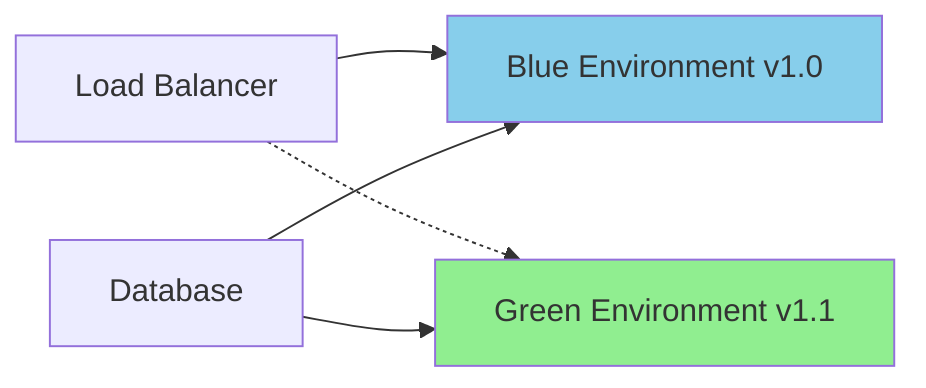
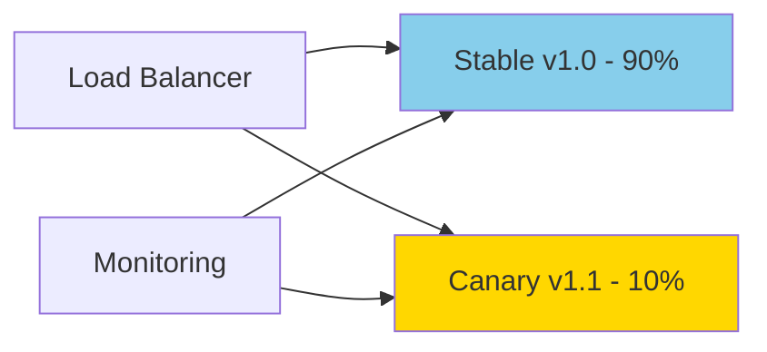
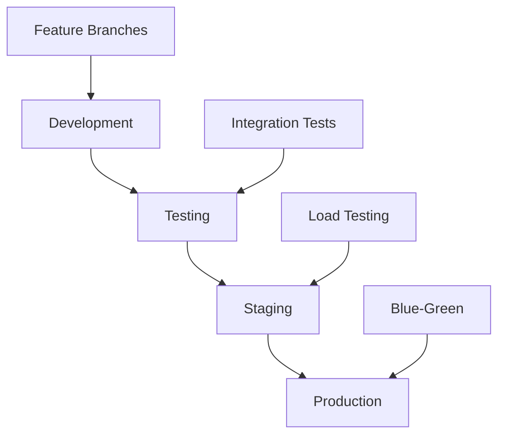

# Advanced Deployment Strategies

This document outlines advanced deployment strategies for the Model Card Generator project.

## Overview

Modern deployment strategies ensure zero-downtime releases, risk mitigation, and rapid rollback capabilities for production systems.

## Deployment Patterns

### 1. Blue-Green Deployment

**Best for**: Production environments requiring zero downtime



#### Implementation

```yaml
# kubernetes/blue-green-deployment.yaml
apiVersion: argoproj.io/v1alpha1
kind: Rollout
metadata:
  name: modelcard-generator
spec:
  replicas: 3
  strategy:
    blueGreen:
      activeService: modelcard-active
      previewService: modelcard-preview
      prePromotionAnalysis:
        templates:
        - templateName: success-rate
        args:
        - name: service-name
          value: modelcard-preview
      scaleDownDelaySeconds: 30
      autoPromotionEnabled: false
```

#### Workflow Integration

```yaml
# .github/workflows/blue-green-deploy.yml
name: Blue-Green Deployment

on:
  push:
    branches: [main]
    tags: ['v*']

jobs:
  deploy:
    runs-on: ubuntu-latest
    environment: production
    
    steps:
    - name: Deploy to Green Environment
      run: |
        kubectl set image deployment/modelcard-green \
          app=modelcard:${{ github.sha }}
    
    - name: Health Check Green Environment
      run: |
        ./scripts/health-check.sh green
    
    - name: Switch Traffic to Green
      run: |
        kubectl patch service modelcard-active \
          -p '{"spec":{"selector":{"version":"green"}}}'
    
    - name: Verify Production Traffic
      run: |
        ./scripts/verify-traffic.sh
    
    - name: Scale Down Blue Environment
      run: |
        kubectl scale deployment modelcard-blue --replicas=0
```

### 2. Canary Deployment

**Best for**: Gradual rollouts with traffic splitting



#### Configuration

```yaml
# kubernetes/canary-deployment.yaml
apiVersion: argoproj.io/v1alpha1
kind: Rollout
metadata:
  name: modelcard-generator
spec:
  replicas: 10
  strategy:
    canary:
      steps:
      - setWeight: 10
      - pause: {duration: 5m}
      - analysis:
          templates:
          - templateName: error-rate
          - templateName: response-time
      - setWeight: 25
      - pause: {duration: 10m}
      - setWeight: 50
      - pause: {duration: 15m}
      - setWeight: 100
      
      canaryService: modelcard-canary
      stableService: modelcard-stable
      trafficRouting:
        istio:
          virtualService:
            name: modelcard-vs
```

#### Monitoring Integration

```python
# scripts/canary-monitor.py
import requests
import time
from prometheus_client.parser import text_string_to_metric_families

def monitor_canary_metrics():
    """Monitor canary deployment metrics"""
    metrics = {
        'error_rate': 0.0,
        'response_time_p99': 0.0,
        'success_rate': 0.0
    }
    
    # Query Prometheus metrics
    response = requests.get('http://prometheus:9090/api/v1/query', {
        'query': 'rate(http_requests_total{job="modelcard-canary",status=~"5.."}[5m])'
    })
    
    if response.status_code == 200:
        data = response.json()
        if data['data']['result']:
            metrics['error_rate'] = float(data['data']['result'][0]['value'][1])
    
    # Decision logic
    if metrics['error_rate'] > 0.05:  # 5% error rate threshold
        print("❌ Canary deployment failed - high error rate")
        return False
    
    if metrics['response_time_p99'] > 2000:  # 2s response time threshold
        print("❌ Canary deployment failed - high latency")
        return False
    
    print("✅ Canary deployment healthy")
    return True
```

### 3. Rolling Deployment

**Best for**: Standard updates with controlled rollout

```yaml
# kubernetes/rolling-deployment.yaml
apiVersion: apps/v1
kind: Deployment
metadata:
  name: modelcard-generator
spec:
  replicas: 6
  strategy:
    type: RollingUpdate
    rollingUpdate:
      maxUnavailable: 1
      maxSurge: 2
  template:
    spec:
      containers:
      - name: app
        image: modelcard-generator:latest
        readinessProbe:
          httpGet:
            path: /health
            port: 8080
          initialDelaySeconds: 10
          periodSeconds: 5
        livenessProbe:
          httpGet:
            path: /health
            port: 8080
          initialDelaySeconds: 30
          periodSeconds: 10
```

## Environment Strategy

### 1. Multi-Environment Pipeline



#### Environment Configuration

```yaml
# environments/development.yml
environment: development
replicas: 1
resources:
  requests:
    cpu: 100m
    memory: 256Mi
  limits:
    cpu: 500m
    memory: 512Mi
database:
  size: small
monitoring:
  enabled: false

---
# environments/production.yml
environment: production
replicas: 6
resources:
  requests:
    cpu: 500m
    memory: 1Gi
  limits:
    cpu: 2000m
    memory: 4Gi
database:
  size: large
  replicas: 3
monitoring:
  enabled: true
  alerting: true
```

### 2. Infrastructure as Code

```terraform
# terraform/environments/production/main.tf
module "modelcard_cluster" {
  source = "../../modules/kubernetes-cluster"
  
  environment = "production"
  node_count  = 6
  node_size   = "standard-4"
  
  tags = {
    Project     = "modelcard-generator"
    Environment = "production"
    ManagedBy   = "terraform"
  }
}

module "database" {
  source = "../../modules/postgresql"
  
  instance_class = "db.r5.xlarge"
  storage_size   = 100
  multi_az       = true
  backup_retention = 7
  
  depends_on = [module.modelcard_cluster]
}

module "monitoring" {
  source = "../../modules/monitoring"
  
  prometheus_storage = "100Gi"
  grafana_enabled    = true
  alertmanager_enabled = true
  
  depends_on = [module.modelcard_cluster]
}
```

## Deployment Automation

### 1. GitOps with ArgoCD

```yaml
# argocd/application.yaml
apiVersion: argoproj.io/v1alpha1
kind: Application
metadata:
  name: modelcard-generator
  namespace: argocd
spec:
  project: default
  source:
    repoURL: https://github.com/terragonlabs/modelcard-as-code-generator
    targetRevision: HEAD
    path: kubernetes/
  destination:
    server: https://kubernetes.default.svc
    namespace: modelcard
  syncPolicy:
    automated:
      prune: true
      selfHeal: true
    syncOptions:
    - CreateNamespace=true
    retry:
      limit: 5
      backoff:
        duration: 5s
        factor: 2
        maxDuration: 3m
```

### 2. Helm Charts

```yaml
# charts/modelcard-generator/values.yaml
replicaCount: 3

image:
  repository: terragonlabs/modelcard-generator
  pullPolicy: IfNotPresent
  tag: ""

service:
  type: ClusterIP
  port: 80

ingress:
  enabled: true
  className: "nginx"
  annotations:
    cert-manager.io/cluster-issuer: "letsencrypt-prod"
  hosts:
    - host: modelcard.terragonlabs.com
      paths:
        - path: /
          pathType: Prefix
  tls:
    - secretName: modelcard-tls
      hosts:
        - modelcard.terragonlabs.com

autoscaling:
  enabled: true
  minReplicas: 3
  maxReplicas: 20
  targetCPUUtilizationPercentage: 70

resources:
  limits:
    cpu: 1000m
    memory: 2Gi
  requests:
    cpu: 500m
    memory: 1Gi
```

## Rollback Strategies

### 1. Automated Rollback

```bash
#!/bin/bash
# scripts/auto-rollback.sh

set -e

DEPLOYMENT_NAME="modelcard-generator"
NAMESPACE="modelcard"
ERROR_THRESHOLD=5  # Percentage
RESPONSE_TIME_THRESHOLD=2000  # Milliseconds

echo "🔍 Monitoring deployment health..."

# Check error rate
ERROR_RATE=$(kubectl exec -n monitoring prometheus-0 -- \
  wget -qO- 'http://localhost:9090/api/v1/query?query=rate(http_requests_total{job="'${DEPLOYMENT_NAME}'",status=~"5.."}[5m])*100' | \
  jq -r '.data.result[0].value[1] // "0"')

# Check response time
RESPONSE_TIME=$(kubectl exec -n monitoring prometheus-0 -- \
  wget -qO- 'http://localhost:9090/api/v1/query?query=histogram_quantile(0.95,rate(http_request_duration_seconds_bucket{job="'${DEPLOYMENT_NAME}'"}[5m]))*1000' | \
  jq -r '.data.result[0].value[1] // "0"')

echo "📊 Current metrics:"
echo "   Error rate: ${ERROR_RATE}%"
echo "   P95 response time: ${RESPONSE_TIME}ms"

# Decision logic
if (( $(echo "$ERROR_RATE > $ERROR_THRESHOLD" | bc -l) )); then
    echo "❌ Error rate too high, initiating rollback..."
    kubectl rollout undo deployment/$DEPLOYMENT_NAME -n $NAMESPACE
    exit 1
fi

if (( $(echo "$RESPONSE_TIME > $RESPONSE_TIME_THRESHOLD" | bc -l) )); then
    echo "❌ Response time too high, initiating rollback..."
    kubectl rollout undo deployment/$DEPLOYMENT_NAME -n $NAMESPACE
    exit 1
fi

echo "✅ Deployment healthy"
```

### 2. Manual Rollback Procedures

```bash
# Quick rollback commands
kubectl rollout undo deployment/modelcard-generator -n modelcard

# Rollback to specific revision
kubectl rollout undo deployment/modelcard-generator --to-revision=3 -n modelcard

# Check rollout status
kubectl rollout status deployment/modelcard-generator -n modelcard

# View rollout history
kubectl rollout history deployment/modelcard-generator -n modelcard
```

## Security Considerations

### 1. Secure Deployment Pipeline

```yaml
# security/security-policy.yaml
apiVersion: v1
kind: SecurityContext
spec:
  runAsNonRoot: true
  runAsUser: 1001
  runAsGroup: 1001
  fsGroup: 1001
  seccompProfile:
    type: RuntimeDefault
  capabilities:
    drop:
    - ALL
  readOnlyRootFilesystem: true
  allowPrivilegeEscalation: false
```

### 2. Image Scanning

```yaml
# .github/workflows/container-security.yml
name: Container Security

on:
  push:
    branches: [main]

jobs:
  scan:
    runs-on: ubuntu-latest
    steps:
    - name: Build image
      run: docker build -t modelcard:${{ github.sha }} .
    
    - name: Run Trivy vulnerability scanner
      uses: aquasecurity/trivy-action@master
      with:
        image-ref: 'modelcard:${{ github.sha }}'
        format: 'sarif'
        output: 'trivy-results.sarif'
    
    - name: Upload Trivy scan results
      uses: github/codeql-action/upload-sarif@v2
      with:
        sarif_file: 'trivy-results.sarif'
```

## Monitoring and Observability

### 1. Deployment Metrics

```yaml
# monitoring/deployment-dashboard.json
{
  "dashboard": {
    "id": null,
    "title": "Model Card Generator Deployments",
    "panels": [
      {
        "title": "Deployment Status",
        "type": "stat",
        "targets": [
          {
            "expr": "kube_deployment_status_replicas_available{deployment=\"modelcard-generator\"}"
          }
        ]
      },
      {
        "title": "Pod Restart Rate",
        "type": "graph",
        "targets": [
          {
            "expr": "rate(kube_pod_container_status_restarts_total{pod=~\"modelcard-generator-.*\"}[5m])"
          }
        ]
      }
    ]
  }
}
```

### 2. Alerting Rules

```yaml
# monitoring/deployment-alerts.yml
groups:
- name: deployment
  rules:
  - alert: DeploymentReplicasMismatch
    expr: kube_deployment_spec_replicas{deployment="modelcard-generator"} != kube_deployment_status_replicas_available{deployment="modelcard-generator"}
    for: 5m
    labels:
      severity: warning
    annotations:
      summary: "Deployment has mismatched replicas"
      
  - alert: HighPodRestartRate
    expr: rate(kube_pod_container_status_restarts_total{pod=~"modelcard-generator-.*"}[15m]) > 0.1
    for: 5m
    labels:
      severity: critical
    annotations:
      summary: "High pod restart rate detected"
```

## Best Practices

### 1. Deployment Checklist

- [ ] Database migrations completed
- [ ] Configuration validated
- [ ] Health checks passing
- [ ] Monitoring configured
- [ ] Rollback plan prepared
- [ ] Team notified

### 2. Testing Strategy

- **Unit Tests**: Run before deployment
- **Integration Tests**: Validate API endpoints
- **Load Tests**: Verify performance under load
- **Smoke Tests**: Quick production validation
- **Canary Analysis**: Monitor real user traffic

### 3. Communication Plan

```yaml
# deployment-notifications.yml
notifications:
  slack:
    channel: "#deployments"
    webhook: "${SLACK_WEBHOOK_URL}"
    
  email:
    recipients:
      - team@terragonlabs.com
      - devops@terragonlabs.com
    
  pagerduty:
    integration_key: "${PAGERDUTY_INTEGRATION_KEY}"
    severity: "warning"
```

This comprehensive deployment strategy ensures reliable, secure, and observable deployments with minimal risk and maximum automation.