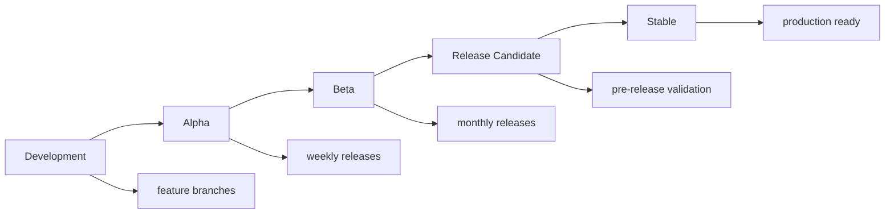

# Release Automation

This document outlines the automated release process for the Model Card Generator project, ensuring consistent, reliable, and traceable software releases.

## Release Strategy

### Semantic Versioning

We follow [Semantic Versioning 2.0.0](https://semver.org/):

- **MAJOR** version for incompatible API changes
- **MINOR** version for new functionality (backward compatible)  
- **PATCH** version for bug fixes (backward compatible)

### Release Channels



#### Channel Definitions

| Channel | Purpose | Frequency | Stability |
|---------|---------|-----------|-----------|
| **Alpha** | Early testing, breaking changes allowed | Weekly | Unstable |
| **Beta** | Feature complete, API stable | Bi-weekly | Testing |
| **RC** | Release candidate, production-like | As needed | Near-stable |
| **Stable** | Production ready | Monthly | Stable |

## Automated Release Pipeline

### 1. Version Management

```bash
#!/bin/bash
# scripts/bump-version.sh

set -e

CURRENT_VERSION=$(python -c "import toml; print(toml.load('pyproject.toml')['project']['version'])")
BUMP_TYPE=${1:-patch}  # major, minor, patch

echo "Current version: $CURRENT_VERSION"

# Calculate next version
case $BUMP_TYPE in
    major)
        NEXT_VERSION=$(echo $CURRENT_VERSION | awk -F. '{print ($1+1)".0.0"}')
        ;;
    minor)
        NEXT_VERSION=$(echo $CURRENT_VERSION | awk -F. '{print $1"."($2+1)".0"}')
        ;;
    patch)
        NEXT_VERSION=$(echo $CURRENT_VERSION | awk -F. '{print $1"."$2"."($3+1)}')
        ;;
esac

echo "Next version: $NEXT_VERSION"

# Update version in pyproject.toml
python scripts/update_version.py $NEXT_VERSION

# Update version in source code
sed -i "s/__version__ = \"$CURRENT_VERSION\"/__version__ = \"$NEXT_VERSION\"/" src/modelcard_generator/__init__.py

# Update CHANGELOG.md
python scripts/update_changelog.py $NEXT_VERSION

echo "Version bumped to $NEXT_VERSION"
```

### 2. Automated Changelog Generation

```python
# scripts/update_changelog.py
import sys
import subprocess
from datetime import datetime
from pathlib import Path

def get_commits_since_last_tag():
    """Get commits since last tag for changelog."""
    try:
        # Get last tag
        last_tag = subprocess.check_output(['git', 'describe', '--tags', '--abbrev=0']).decode().strip()
        
        # Get commits since last tag
        commits = subprocess.check_output([
            'git', 'log', f'{last_tag}..HEAD', 
            '--pretty=format:%s (%h)', '--no-merges'
        ]).decode().strip().split('\n')
        
        return commits if commits != [''] else []
    except subprocess.CalledProcessError:
        # No previous tags
        commits = subprocess.check_output([
            'git', 'log', '--pretty=format:%s (%h)', '--no-merges'
        ]).decode().strip().split('\n')
        return commits

def categorize_commits(commits):
    """Categorize commits by type."""
    categories = {
        'feat': [],
        'fix': [],
        'docs': [],
        'style': [],
        'refactor': [],
        'test': [],
        'chore': [],
        'breaking': []
    }
    
    for commit in commits:
        if commit.startswith('feat'):
            categories['feat'].append(commit)
        elif commit.startswith('fix'):
            categories['fix'].append(commit)
        elif commit.startswith('docs'):
            categories['docs'].append(commit)
        elif commit.startswith('BREAKING CHANGE') or '!' in commit:
            categories['breaking'].append(commit)
        elif any(commit.startswith(prefix) for prefix in ['style', 'refactor', 'test', 'chore']):
            for prefix in ['style', 'refactor', 'test', 'chore']:
                if commit.startswith(prefix):
                    categories[prefix].append(commit)
                    break
        else:
            categories['chore'].append(commit)
    
    return categories

def generate_changelog_entry(version, categories):
    """Generate changelog entry for version."""
    date = datetime.now().strftime('%Y-%m-%d')
    
    entry = f"\n## [{version}] - {date}\n\n"
    
    if categories['breaking']:
        entry += "### ⚠️ BREAKING CHANGES\n\n"
        for commit in categories['breaking']:
            entry += f"- {commit}\n"
        entry += "\n"
    
    if categories['feat']:
        entry += "### ✨ Features\n\n"
        for commit in categories['feat']:
            entry += f"- {commit.replace('feat: ', '').replace('feat!: ', '')}\n"
        entry += "\n"
    
    if categories['fix']:
        entry += "### 🐛 Bug Fixes\n\n"
        for commit in categories['fix']:
            entry += f"- {commit.replace('fix: ', '').replace('fix!: ', '')}\n"
        entry += "\n"
    
    if categories['docs']:
        entry += "### 📚 Documentation\n\n"
        for commit in categories['docs']:
            entry += f"- {commit.replace('docs: ', '')}\n"
        entry += "\n"
    
    if categories['refactor']:
        entry += "### ♻️ Code Refactoring\n\n"
        for commit in categories['refactor']:
            entry += f"- {commit.replace('refactor: ', '')}\n"
        entry += "\n"
    
    if categories['test']:
        entry += "### ✅ Tests\n\n"
        for commit in categories['test']:
            entry += f"- {commit.replace('test: ', '')}\n"
        entry += "\n"
    
    return entry

def main():
    if len(sys.argv) != 2:
        print("Usage: python update_changelog.py <version>")
        sys.exit(1)
    
    version = sys.argv[1]
    
    # Get commits and categorize
    commits = get_commits_since_last_tag()
    categories = categorize_commits(commits)
    
    # Generate changelog entry
    entry = generate_changelog_entry(version, categories)
    
    # Update CHANGELOG.md
    changelog_path = Path("CHANGELOG.md")
    if changelog_path.exists():
        content = changelog_path.read_text()
        # Insert new entry after the header
        lines = content.split('\n')
        header_end = next(i for i, line in enumerate(lines) if line.strip() == '')
        lines.insert(header_end + 1, entry.rstrip())
        changelog_path.write_text('\n'.join(lines))
    else:
        # Create new changelog
        header = "# Changelog\n\nAll notable changes to this project will be documented in this file.\n\nThe format is based on [Keep a Changelog](https://keepachangelog.com/en/1.0.0/),\nand this project adheres to [Semantic Versioning](https://semver.org/spec/v2.0.0.html).\n"
        changelog_path.write_text(header + entry)
    
    print(f"Changelog updated for version {version}")

if __name__ == "__main__":
    main()
```

### 3. Release Workflow

```yaml
# .github/workflows/release.yml
name: Release Automation

on:
  push:
    branches: [main]
    paths:
      - 'pyproject.toml'
  workflow_dispatch:
    inputs:
      version_bump:
        description: 'Version bump type'
        required: true
        default: 'patch'
        type: choice
        options:
          - patch
          - minor
          - major

permissions:
  contents: write
  packages: write
  id-token: write

jobs:
  detect-changes:
    runs-on: ubuntu-latest
    outputs:
      version-changed: ${{ steps.check.outputs.changed }}
      current-version: ${{ steps.version.outputs.current }}
    
    steps:
    - uses: actions/checkout@v4
      with:
        fetch-depth: 2
    
    - name: Check version change
      id: check
      run: |
        CURRENT=$(python -c "import toml; print(toml.load('pyproject.toml')['project']['version'])")
        PREVIOUS=$(git show HEAD~1:pyproject.toml | python -c "import toml, sys; print(toml.load(sys.stdin)['project']['version'])")
        
        echo "current=$CURRENT" >> $GITHUB_OUTPUT
        echo "previous=$PREVIOUS" >> $GITHUB_OUTPUT
        
        if [ "$CURRENT" != "$PREVIOUS" ]; then
          echo "changed=true" >> $GITHUB_OUTPUT
        else
          echo "changed=false" >> $GITHUB_OUTPUT
        fi
    
    - name: Get current version
      id: version
      run: |
        VERSION=$(python -c "import toml; print(toml.load('pyproject.toml')['project']['version'])")
        echo "current=$VERSION" >> $GITHUB_OUTPUT

  build-and-test:
    runs-on: ubuntu-latest
    needs: detect-changes
    if: needs.detect-changes.outputs.version-changed == 'true' || github.event_name == 'workflow_dispatch'
    
    strategy:
      matrix:
        python-version: [3.9, 3.10, 3.11, 3.12]
    
    steps:
    - uses: actions/checkout@v4
    
    - name: Set up Python ${{ matrix.python-version }}
      uses: actions/setup-python@v4
      with:
        python-version: ${{ matrix.python-version }}
    
    - name: Install dependencies
      run: |
        python -m pip install --upgrade pip
        pip install -e ".[dev,test]"
    
    - name: Run full test suite
      run: |
        make test-all
    
    - name: Run security checks
      run: |
        make security-check
    
    - name: Build package
      run: |
        python -m build
    
    - name: Upload build artifacts
      uses: actions/upload-artifact@v3
      with:
        name: dist-${{ matrix.python-version }}
        path: dist/

  create-release:
    runs-on: ubuntu-latest
    needs: [detect-changes, build-and-test]
    if: needs.build-and-test.result == 'success'
    
    steps:
    - uses: actions/checkout@v4
      with:
        fetch-depth: 0
    
    - name: Set up Python
      uses: actions/setup-python@v4
      with:
        python-version: '3.11'
    
    - name: Get version and changelog
      id: release-info
      run: |
        VERSION=$(python -c "import toml; print(toml.load('pyproject.toml')['project']['version'])")
        echo "version=$VERSION" >> $GITHUB_OUTPUT
        
        # Extract changelog for this version
        python scripts/extract_changelog.py $VERSION > release_notes.md
        
        # Check if this is a pre-release
        if [[ $VERSION =~ (alpha|beta|rc) ]]; then
          echo "prerelease=true" >> $GITHUB_OUTPUT
        else
          echo "prerelease=false" >> $GITHUB_OUTPUT
        fi
    
    - name: Create Git tag
      run: |
        git config user.name "github-actions[bot]"
        git config user.email "github-actions[bot]@users.noreply.github.com"
        git tag -a "v${{ steps.release-info.outputs.version }}" -m "Release v${{ steps.release-info.outputs.version }}"
        git push origin "v${{ steps.release-info.outputs.version }}"
    
    - name: Download build artifacts
      uses: actions/download-artifact@v3
      with:
        name: dist-3.11
        path: dist/
    
    - name: Create GitHub Release
      uses: actions/create-release@v1
      env:
        GITHUB_TOKEN: ${{ secrets.GITHUB_TOKEN }}
      with:
        tag_name: v${{ steps.release-info.outputs.version }}
        release_name: Model Card Generator v${{ steps.release-info.outputs.version }}
        body_path: release_notes.md
        draft: false
        prerelease: ${{ steps.release-info.outputs.prerelease }}
    
    - name: Upload release assets
      uses: actions/upload-release-asset@v1
      env:
        GITHUB_TOKEN: ${{ secrets.GITHUB_TOKEN }}
      with:
        upload_url: ${{ steps.create-release.outputs.upload_url }}
        asset_path: dist/
        asset_name: modelcard-generator-${{ steps.release-info.outputs.version }}
        asset_content_type: application/zip

  publish-pypi:
    runs-on: ubuntu-latest
    needs: create-release
    if: needs.create-release.result == 'success'
    environment: 
      name: pypi
      url: https://pypi.org/p/modelcard-as-code-generator
    
    steps:
    - uses: actions/checkout@v4
    
    - name: Set up Python
      uses: actions/setup-python@v4
      with:
        python-version: '3.11'
    
    - name: Install build dependencies
      run: |
        python -m pip install --upgrade pip
        pip install build twine
    
    - name: Build package
      run: |
        python -m build
    
    - name: Check package
      run: |
        twine check dist/*
    
    - name: Publish to PyPI
      uses: pypa/gh-action-pypi-publish@release/v1
      with:
        user: __token__
        password: ${{ secrets.PYPI_API_TOKEN }}
        verbose: true

  publish-docker:
    runs-on: ubuntu-latest
    needs: create-release
    if: needs.create-release.result == 'success'
    
    steps:
    - uses: actions/checkout@v4
    
    - name: Set up Docker Buildx
      uses: docker/setup-buildx-action@v3
    
    - name: Login to Docker Hub
      uses: docker/login-action@v3
      with:
        username: ${{ secrets.DOCKER_USERNAME }}
        password: ${{ secrets.DOCKER_PASSWORD }}
    
    - name: Get version info
      id: version
      run: |
        VERSION=$(python -c "import toml; print(toml.load('pyproject.toml')['project']['version'])")
        echo "version=$VERSION" >> $GITHUB_OUTPUT
        
        # Determine tags
        TAGS="terragonlabs/modelcard-generator:$VERSION"
        
        if [[ ! $VERSION =~ (alpha|beta|rc) ]]; then
          TAGS="$TAGS,terragonlabs/modelcard-generator:latest"
        fi
        
        echo "tags=$TAGS" >> $GITHUB_OUTPUT
    
    - name: Build and push Docker image
      uses: docker/build-push-action@v5
      with:
        context: .
        platforms: linux/amd64,linux/arm64
        push: true
        tags: ${{ steps.version.outputs.tags }}
        labels: |
          org.opencontainers.image.title=Model Card Generator
          org.opencontainers.image.description=Automated generation of Model Cards as executable, versioned artifacts
          org.opencontainers.image.version=${{ steps.version.outputs.version }}
          org.opencontainers.image.source=https://github.com/terragonlabs/modelcard-as-code-generator
          org.opencontainers.image.licenses=MIT

  update-documentation:
    runs-on: ubuntu-latest
    needs: [publish-pypi, publish-docker]
    if: always() && (needs.publish-pypi.result == 'success' || needs.publish-docker.result == 'success')
    
    steps:
    - uses: actions/checkout@v4
      with:
        token: ${{ secrets.GITHUB_TOKEN }}
    
    - name: Set up Python
      uses: actions/setup-python@v4
      with:
        python-version: '3.11'
    
    - name: Install documentation dependencies
      run: |
        pip install -e ".[docs]"
    
    - name: Update API documentation
      run: |
        python scripts/generate_api_docs.py
    
    - name: Deploy documentation
      run: |
        mkdocs gh-deploy --force
    
    - name: Update version badges
      run: |
        VERSION=$(python -c "import toml; print(toml.load('pyproject.toml')['project']['version'])")
        sed -i "s/version-[0-9.]*/version-$VERSION/g" README.md
        
        git config user.name "github-actions[bot]"
        git config user.email "github-actions[bot]@users.noreply.github.com"
        git add README.md
        git commit -m "docs: update version badges to $VERSION" || exit 0
        git push

  notify-release:
    runs-on: ubuntu-latest
    needs: [publish-pypi, publish-docker, update-documentation]
    if: always()
    
    steps:
    - name: Get release info
      id: info
      run: |
        VERSION=$(python -c "import toml; print(toml.load('pyproject.toml')['project']['version'])")
        echo "version=$VERSION" >> $GITHUB_OUTPUT
        
        if [[ "${{ needs.publish-pypi.result }}" == "success" && "${{ needs.publish-docker.result }}" == "success" ]]; then
          echo "status=success" >> $GITHUB_OUTPUT
          echo "message=🎉 Release v$VERSION published successfully!" >> $GITHUB_OUTPUT
        else
          echo "status=failure" >> $GITHUB_OUTPUT
          echo "message=❌ Release v$VERSION failed to publish" >> $GITHUB_OUTPUT
        fi
    
    - name: Notify Slack
      uses: 8398a7/action-slack@v3
      with:
        status: custom
        custom_payload: |
          {
            "text": "${{ steps.info.outputs.message }}",
            "blocks": [
              {
                "type": "section",
                "text": {
                  "type": "mrkdwn",
                  "text": "${{ steps.info.outputs.message }}\n\n*Version:* ${{ steps.info.outputs.version }}\n*PyPI:* https://pypi.org/project/modelcard-as-code-generator/${{ steps.info.outputs.version }}/\n*Docker:* `docker pull terragonlabs/modelcard-generator:${{ steps.info.outputs.version }}`"
                }
              }
            ]
          }
      env:
        SLACK_WEBHOOK_URL: ${{ secrets.SLACK_WEBHOOK_URL }}
    
    - name: Create GitHub Discussion
      uses: actions/github-script@v6
      with:
        script: |
          const version = "${{ steps.info.outputs.version }}";
          
          github.rest.teams.addOrUpdateRepoPermissions({
            owner: context.repo.owner,
            repo: context.repo.repo,
            team_slug: 'maintainers',
            permission: 'admin'
          });
          
          github.rest.repos.createDiscussion({
            owner: context.repo.owner,
            repo: context.repo.repo,
            title: `🎉 Release v${version} is now available!`,
            body: `
              # Model Card Generator v${version} Released!
              
              We're excited to announce the release of Model Card Generator v${version}!
              
              ## 📦 Installation
              
              \`\`\`bash
              pip install modelcard-as-code-generator==${version}
              \`\`\`
              
              Or using Docker:
              
              \`\`\`bash
              docker pull terragonlabs/modelcard-generator:${version}
              \`\`\`
              
              ## 📖 Documentation
              
              - [Release Notes](https://github.com/terragonlabs/modelcard-as-code-generator/releases/tag/v${version})
              - [Documentation](https://docs.terragonlabs.com/modelcard-generator)
              - [Migration Guide](https://docs.terragonlabs.com/modelcard-generator/migration)
              
              ## 🤝 Feedback
              
              We'd love to hear your feedback! Please share your experience, report any issues, or suggest improvements.
              
              Thank you for using Model Card Generator! 🙏
            `,
            category_id: 'releases'
          });
```

### 4. Release Quality Gates

```bash
#!/bin/bash
# scripts/release-quality-gate.sh

set -e

VERSION=$1
if [ -z "$VERSION" ]; then
    echo "Usage: $0 <version>"
    exit 1
fi

echo "🚪 Running release quality gates for version $VERSION..."

# Gate 1: All tests pass
echo "✅ Running full test suite..."
make test-all || {
    echo "❌ Tests failed"
    exit 1
}

# Gate 2: Security scan clean
echo "🔒 Running security scan..."
make security-check || {
    echo "❌ Security issues found"
    exit 1
}

# Gate 3: Documentation up to date
echo "📚 Checking documentation..."
python scripts/check_docs_current.py || {
    echo "❌ Documentation out of date"
    exit 1
}

# Gate 4: Performance benchmarks
echo "⚡ Running performance benchmarks..."
pytest tests/performance/ --benchmark-compare-fail=mean:5% || {
    echo "❌ Performance regression detected"
    exit 1
}

# Gate 5: License compliance
echo "⚖️ Checking license compliance..."
python scripts/check_licenses.py || {
    echo "❌ License compliance issues"
    exit 1
}

# Gate 6: Changelog updated
echo "📝 Verifying changelog..."
if ! grep -q "## \[$VERSION\]" CHANGELOG.md; then
    echo "❌ Changelog not updated for version $VERSION"
    exit 1
fi

# Gate 7: Version consistency
echo "🔢 Checking version consistency..."
PYPROJECT_VERSION=$(python -c "import toml; print(toml.load('pyproject.toml')['project']['version'])")
SOURCE_VERSION=$(python -c "from src.modelcard_generator import __version__; print(__version__)")

if [ "$PYPROJECT_VERSION" != "$VERSION" ] || [ "$SOURCE_VERSION" != "$VERSION" ]; then
    echo "❌ Version mismatch: pyproject.toml=$PYPROJECT_VERSION, source=$SOURCE_VERSION, expected=$VERSION"
    exit 1
fi

echo "🎉 All quality gates passed for version $VERSION"
```

### 5. Release Monitoring

```python
# scripts/monitor_release.py
import requests
import time
import sys
from packaging import version

def check_pypi_availability(package_name, expected_version, timeout=300):
    """Check if package is available on PyPI."""
    start_time = time.time()
    
    while time.time() - start_time < timeout:
        try:
            response = requests.get(f"https://pypi.org/pypi/{package_name}/json")
            if response.status_code == 200:
                data = response.json()
                latest_version = data['info']['version']
                
                if version.parse(latest_version) >= version.parse(expected_version):
                    print(f"✅ Package {package_name} v{expected_version} is available on PyPI")
                    return True
                    
        except Exception as e:
            print(f"Error checking PyPI: {e}")
        
        time.sleep(30)
    
    print(f"❌ Package {package_name} v{expected_version} not available on PyPI within {timeout}s")
    return False

def check_docker_availability(image_name, expected_version, timeout=300):
    """Check if Docker image is available."""
    start_time = time.time()
    
    while time.time() - start_time < timeout:
        try:
            # Check Docker Hub API
            response = requests.get(f"https://registry.hub.docker.com/v2/repositories/{image_name}/tags/{expected_version}")
            if response.status_code == 200:
                print(f"✅ Docker image {image_name}:{expected_version} is available")
                return True
                
        except Exception as e:
            print(f"Error checking Docker Hub: {e}")
        
        time.sleep(30)
    
    print(f"❌ Docker image {image_name}:{expected_version} not available within {timeout}s")
    return False

def check_documentation_deployment(docs_url, expected_version):
    """Check if documentation is deployed with correct version."""
    try:
        response = requests.get(f"{docs_url}/version.json")
        if response.status_code == 200:
            data = response.json()
            if data.get('version') == expected_version:
                print(f"✅ Documentation deployed with version {expected_version}")
                return True
    except Exception as e:
        print(f"Error checking documentation: {e}")
    
    print(f"❌ Documentation not updated to version {expected_version}")
    return False

def main():
    if len(sys.argv) != 2:
        print("Usage: python monitor_release.py <version>")
        sys.exit(1)
    
    expected_version = sys.argv[1]
    
    print(f"🔍 Monitoring release deployment for version {expected_version}...")
    
    # Check all deployment targets
    results = []
    
    results.append(check_pypi_availability("modelcard-as-code-generator", expected_version))
    results.append(check_docker_availability("terragonlabs/modelcard-generator", expected_version))
    results.append(check_documentation_deployment("https://docs.terragonlabs.com/modelcard-generator", expected_version))
    
    if all(results):
        print(f"🎉 Release {expected_version} successfully deployed to all targets!")
        sys.exit(0)
    else:
        print(f"❌ Release {expected_version} deployment incomplete")
        sys.exit(1)

if __name__ == "__main__":
    main()
```

## Release Types

### 1. Hotfix Releases

```yaml
# .github/workflows/hotfix-release.yml
name: Hotfix Release

on:
  push:
    branches: [hotfix/*]

jobs:
  hotfix-release:
    runs-on: ubuntu-latest
    
    steps:
    - uses: actions/checkout@v4
    
    - name: Extract hotfix version
      id: version
      run: |
        BRANCH_NAME=${GITHUB_REF#refs/heads/}
        VERSION=${BRANCH_NAME#hotfix/}
        echo "version=$VERSION" >> $GITHUB_OUTPUT
    
    - name: Run critical tests only
      run: |
        pytest tests/unit/ tests/security/ -m "not slow"
    
    - name: Create hotfix release
      run: |
        python scripts/create_hotfix_release.py ${{ steps.version.outputs.version }}
```

### 2. Feature Releases

```bash
#!/bin/bash
# scripts/feature-release.sh

set -e

FEATURE_BRANCH=$1
TARGET_VERSION=$2

echo "🚀 Creating feature release from $FEATURE_BRANCH to $TARGET_VERSION"

# Merge feature branch
git checkout main
git pull origin main
git merge --no-ff $FEATURE_BRANCH

# Bump version
python scripts/bump_version.py minor

# Update changelog with feature details
python scripts/update_changelog.py $TARGET_VERSION --feature-branch $FEATURE_BRANCH

# Run full test suite
make test-all

# Create release
git add .
git commit -m "chore: release $TARGET_VERSION"
git tag -a "v$TARGET_VERSION" -m "Release v$TARGET_VERSION"
git push origin main --tags

echo "✅ Feature release $TARGET_VERSION created successfully"
```

## Rollback Procedures

### 1. Automated Rollback

```bash
#!/bin/bash
# scripts/rollback-release.sh

set -e

VERSION_TO_ROLLBACK=$1
ROLLBACK_TO_VERSION=$2

echo "🔄 Rolling back from $VERSION_TO_ROLLBACK to $ROLLBACK_TO_VERSION"

# Remove from PyPI (contact PyPI support for this)
echo "⚠️ Manual step required: Contact PyPI support to remove version $VERSION_TO_ROLLBACK"

# Remove Docker images
docker rmi terragonlabs/modelcard-generator:$VERSION_TO_ROLLBACK || true

# Remove GitHub release
gh release delete "v$VERSION_TO_ROLLBACK" --yes

# Remove Git tag
git tag -d "v$VERSION_TO_ROLLBACK"
git push origin --delete "v$VERSION_TO_ROLLBACK"

# Revert version changes
git revert --no-edit $(git log --oneline --grep="release $VERSION_TO_ROLLBACK" --format="%H")

echo "✅ Rollback completed. Please verify all systems are stable."
```

This comprehensive release automation ensures consistent, reliable, and traceable software releases with proper quality gates and monitoring.