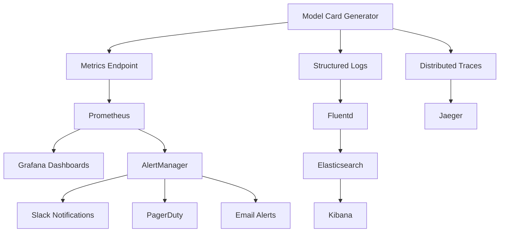

# Observability Guide

## Overview

The Model Card Generator includes comprehensive observability features for monitoring performance, reliability, and usage patterns in production environments.

## Monitoring Stack

### Core Components

1. **Prometheus** - Metrics collection and storage
2. **Grafana** - Visualization and dashboards
3. **AlertManager** - Alert routing and notification
4. **Jaeger** - Distributed tracing (optional)
5. **ELK Stack** - Centralized logging (optional)

### Architecture



## Metrics Collection

### Application Metrics

The generator exposes metrics on `/metrics` endpoint:

```prometheus
# Request metrics
http_requests_total{method="POST",endpoint="/generate"}
http_request_duration_seconds{method="POST",endpoint="/generate"}
http_request_size_bytes{method="POST",endpoint="/generate"}
http_response_size_bytes{method="POST",endpoint="/generate"}

# Generation metrics
modelcard_generation_total{format="huggingface",status="success"}
modelcard_generation_duration_seconds{format="huggingface"}
modelcard_validation_total{standard="eu_cra",status="success"}
modelcard_template_cache_hits_total
modelcard_template_cache_misses_total

# System metrics
python_gc_objects_collected_total
python_gc_time_seconds
process_cpu_seconds_total
process_memory_bytes
process_open_fds

# Business metrics
modelcard_formats_generated_total{format="huggingface"}
modelcard_compliance_checks_total{standard="gdpr",result="pass"}
modelcard_drift_detections_total{threshold_exceeded="true"}
```

### Custom Metrics

Add custom metrics to your application:

```python
from prometheus_client import Counter, Histogram, Gauge

# Custom metrics
GENERATION_COUNTER = Counter(
    'modelcard_generation_total',
    'Total model card generations',
    ['format', 'status']
)

GENERATION_DURATION = Histogram(
    'modelcard_generation_duration_seconds',
    'Time spent generating model cards',
    ['format']
)

ACTIVE_GENERATIONS = Gauge(
    'modelcard_active_generations',
    'Number of active model card generations'
)

# Usage in code
with GENERATION_DURATION.labels(format='huggingface').time():
    ACTIVE_GENERATIONS.inc()
    try:
        card = generator.generate(eval_results, format='huggingface')
        GENERATION_COUNTER.labels(format='huggingface', status='success').inc()
    except Exception as e:
        GENERATION_COUNTER.labels(format='huggingface', status='error').inc()
        raise
    finally:
        ACTIVE_GENERATIONS.dec()
```

## Grafana Dashboards

### Main Dashboard Panels

1. **Overview**
   - Total generations per hour
   - Success rate percentage
   - Average generation time
   - Active users

2. **Performance**
   - Response time percentiles (P50, P95, P99)
   - Memory usage
   - CPU utilization
   - Cache hit rates

3. **Errors**
   - Error rate by endpoint
   - Error types distribution
   - Failed generations by format
   - Alert history

4. **Business Metrics**
   - Most popular formats
   - Compliance check results
   - Template usage statistics
   - Drift detection alerts

### Dashboard JSON

```json
{
  "dashboard": {
    "title": "Model Card Generator - Overview",
    "panels": [
      {
        "title": "Generation Rate",
        "type": "stat",
        "targets": [
          {
            "expr": "rate(modelcard_generation_total[5m])",
            "legendFormat": "Generations/sec"
          }
        ]
      },
      {
        "title": "Success Rate",
        "type": "stat",
        "targets": [
          {
            "expr": "rate(modelcard_generation_total{status=\"success\"}[5m]) / rate(modelcard_generation_total[5m]) * 100",
            "legendFormat": "Success %"
          }
        ]
      },
      {
        "title": "Response Time",
        "type": "graph",
        "targets": [
          {
            "expr": "histogram_quantile(0.50, rate(http_request_duration_seconds_bucket[5m]))",
            "legendFormat": "P50"
          },
          {
            "expr": "histogram_quantile(0.95, rate(http_request_duration_seconds_bucket[5m]))",
            "legendFormat": "P95"
          }
        ]
      }
    ]
  }
}
```

## Alerting Rules

### Critical Alerts

```yaml
# monitoring/rules/critical.yml
groups:
  - name: modelcard-generator.critical
    rules:
      - alert: HighErrorRate
        expr: rate(modelcard_generation_total{status="error"}[5m]) / rate(modelcard_generation_total[5m]) > 0.1
        for: 2m
        labels:
          severity: critical
        annotations:
          summary: "High error rate in model card generation"
          description: "Error rate is {{ $value | humanizePercentage }} over the last 5 minutes"
      
      - alert: ServiceDown
        expr: up{job="modelcard-generator"} == 0
        for: 1m
        labels:
          severity: critical
        annotations:
          summary: "Model Card Generator service is down"
          description: "Service has been down for more than 1 minute"
      
      - alert: HighResponseTime
        expr: histogram_quantile(0.95, rate(http_request_duration_seconds_bucket[5m])) > 10
        for: 5m
        labels:
          severity: critical
        annotations:
          summary: "High response time"
          description: "95th percentile response time is {{ $value }}s"
```

### Warning Alerts

```yaml
# monitoring/rules/warning.yml
groups:
  - name: modelcard-generator.warning
    rules:
      - alert: HighMemoryUsage
        expr: process_memory_bytes / 1024 / 1024 / 1024 > 1.5
        for: 5m
        labels:
          severity: warning
        annotations:
          summary: "High memory usage"
          description: "Memory usage is {{ $value | humanize }}GB"
      
      - alert: LowCacheHitRate
        expr: rate(modelcard_template_cache_hits_total[5m]) / (rate(modelcard_template_cache_hits_total[5m]) + rate(modelcard_template_cache_misses_total[5m])) < 0.8
        for: 10m
        labels:
          severity: warning
        annotations:
          summary: "Low template cache hit rate"
          description: "Cache hit rate is {{ $value | humanizePercentage }}"
```

## Structured Logging

### Log Configuration

```python
# src/modelcard_generator/logging_config.py
import logging
import json
from datetime import datetime

class JSONFormatter(logging.Formatter):
    def format(self, record):
        log_entry = {
            'timestamp': datetime.utcnow().isoformat(),
            'level': record.levelname,
            'logger': record.name,
            'message': record.getMessage(),
            'module': record.module,
            'function': record.funcName,
            'line': record.lineno
        }
        
        # Add extra fields
        if hasattr(record, 'user_id'):
            log_entry['user_id'] = record.user_id
        if hasattr(record, 'request_id'):
            log_entry['request_id'] = record.request_id
        if hasattr(record, 'generation_id'):
            log_entry['generation_id'] = record.generation_id
            
        return json.dumps(log_entry)

# Configure logging
def setup_logging():
    logger = logging.getLogger('modelcard_generator')
    handler = logging.StreamHandler()
    handler.setFormatter(JSONFormatter())
    logger.addHandler(handler)
    logger.setLevel(logging.INFO)
    return logger
```

### Log Usage

```python
import logging
import uuid

logger = logging.getLogger('modelcard_generator')

def generate_model_card(eval_results, format='huggingface'):
    generation_id = str(uuid.uuid4())
    
    logger.info(
        "Starting model card generation",
        extra={
            'generation_id': generation_id,
            'format': format,
            'eval_results_size': len(str(eval_results))
        }
    )
    
    try:
        start_time = time.time()
        card = _generate_card(eval_results, format)
        duration = time.time() - start_time
        
        logger.info(
            "Model card generation completed",
            extra={
                'generation_id': generation_id,
                'format': format,
                'duration_seconds': duration,
                'card_size_bytes': len(card.render())
            }
        )
        
        return card
        
    except Exception as e:
        logger.error(
            "Model card generation failed",
            extra={
                'generation_id': generation_id,
                'format': format,
                'error_type': type(e).__name__,
                'error_message': str(e)
            }
        )
        raise
```

## Distributed Tracing

### Jaeger Integration

```python
# src/modelcard_generator/tracing.py
from opentelemetry import trace
from opentelemetry.exporter.jaeger.thrift import JaegerExporter
from opentelemetry.sdk.trace import TracerProvider
from opentelemetry.sdk.trace.export import BatchSpanProcessor

def setup_tracing():
    trace.set_tracer_provider(TracerProvider())
    tracer = trace.get_tracer(__name__)
    
    jaeger_exporter = JaegerExporter(
        agent_host_name="jaeger",
        agent_port=6831,
    )
    
    span_processor = BatchSpanProcessor(jaeger_exporter)
    trace.get_tracer_provider().add_span_processor(span_processor)
    
    return tracer

# Usage in code
tracer = setup_tracing()

def generate_model_card(eval_results, format='huggingface'):
    with tracer.start_as_current_span("generate_model_card") as span:
        span.set_attribute("format", format)
        span.set_attribute("eval_results_size", len(str(eval_results)))
        
        with tracer.start_as_current_span("validate_input"):
            _validate_eval_results(eval_results)
        
        with tracer.start_as_current_span("load_template"):
            template = _load_template(format)
        
        with tracer.start_as_current_span("render_card"):
            card = template.render(eval_results)
        
        span.set_attribute("card_size", len(card))
        return card
```

## Health Checks

### Health Check Endpoint

```python
# src/modelcard_generator/health.py
from datetime import datetime
import psutil
import threading

class HealthChecker:
    def __init__(self):
        self.last_check = datetime.utcnow()
        self.checks = {
            'database': self._check_database,
            'cache': self._check_cache,
            'disk_space': self._check_disk_space,
            'memory': self._check_memory
        }
    
    def health_check(self):
        results = {
            'status': 'healthy',
            'timestamp': datetime.utcnow().isoformat(),
            'checks': {}
        }
        
        overall_healthy = True
        
        for check_name, check_func in self.checks.items():
            try:
                check_result = check_func()
                results['checks'][check_name] = check_result
                if not check_result.get('healthy', True):
                    overall_healthy = False
            except Exception as e:
                results['checks'][check_name] = {
                    'healthy': False,
                    'error': str(e)
                }
                overall_healthy = False
        
        if not overall_healthy:
            results['status'] = 'unhealthy'
        
        self.last_check = datetime.utcnow()
        return results
    
    def _check_database(self):
        # Check database connection
        return {'healthy': True, 'response_time_ms': 5}
    
    def _check_cache(self):
        # Check cache availability
        return {'healthy': True, 'hit_rate': 0.85}
    
    def _check_disk_space(self):
        disk_usage = psutil.disk_usage('/')
        free_percentage = (disk_usage.free / disk_usage.total) * 100
        return {
            'healthy': free_percentage > 10,
            'free_percentage': free_percentage
        }
    
    def _check_memory(self):
        memory = psutil.virtual_memory()
        return {
            'healthy': memory.percent < 90,
            'usage_percentage': memory.percent
        }
```

## Deployment Monitoring

### Docker Compose with Monitoring

```yaml
# docker-compose.monitoring.yml
version: '3.8'

services:
  prometheus:
    image: prom/prometheus:latest
    ports:
      - "9090:9090"
    volumes:
      - ./monitoring/prometheus.yml:/etc/prometheus/prometheus.yml
      - ./monitoring/rules:/etc/prometheus/rules
    command:
      - '--config.file=/etc/prometheus/prometheus.yml'
      - '--storage.tsdb.retention.time=30d'
      - '--web.enable-lifecycle'

  grafana:
    image: grafana/grafana:latest
    ports:
      - "3000:3000"
    environment:
      - GF_SECURITY_ADMIN_PASSWORD=admin
    volumes:
      - grafana-data:/var/lib/grafana
      - ./monitoring/grafana/provisioning:/etc/grafana/provisioning

  alertmanager:
    image: prom/alertmanager:latest
    ports:
      - "9093:9093"
    volumes:
      - ./monitoring/alertmanager.yml:/etc/alertmanager/alertmanager.yml

  jaeger:
    image: jaegertracing/all-in-one:latest
    ports:
      - "16686:16686"
      - "14268:14268"
    environment:
      - COLLECTOR_ZIPKIN_HTTP_PORT=9411

volumes:
  grafana-data:
```

### Kubernetes Monitoring

```yaml
# k8s/monitoring.yaml
apiVersion: v1
kind: ConfigMap
metadata:
  name: prometheus-config
data:
  prometheus.yml: |
    global:
      scrape_interval: 15s
    scrape_configs:
      - job_name: 'kubernetes-pods'
        kubernetes_sd_configs:
          - role: pod
        relabel_configs:
          - source_labels: [__meta_kubernetes_pod_annotation_prometheus_io_scrape]
            action: keep
            regex: true

---
apiVersion: monitoring.coreos.com/v1
kind: ServiceMonitor
metadata:
  name: modelcard-generator
spec:
  selector:
    matchLabels:
      app: modelcard-generator
  endpoints:
  - port: metrics
    interval: 15s
    path: /metrics
```

## SLI/SLO Definition

### Service Level Indicators (SLIs)

1. **Availability**: Percentage of time service is up
2. **Latency**: Request response time percentiles
3. **Error Rate**: Percentage of failed requests
4. **Throughput**: Requests processed per second

### Service Level Objectives (SLOs)

```yaml
# SLO definitions
slos:
  availability:
    target: 99.9%
    measurement_window: 30d
    
  latency:
    target: 95% of requests under 2s
    measurement_window: 7d
    
  error_rate:
    target: <1% error rate
    measurement_window: 24h
    
  throughput:
    target: >10 requests/second
    measurement_window: 1h
```

### Error Budget Monitoring

```prometheus
# Error budget calculation
(
  1 - (
    sum(rate(http_requests_total{status=~"5.."}[30d])) /
    sum(rate(http_requests_total[30d]))
  )
) * 100
```

## Performance Monitoring

### Key Performance Indicators

1. **Generation Time** - Time to generate model cards
2. **Memory Usage** - RAM consumption patterns  
3. **Cache Performance** - Template cache hit rates
4. **Concurrent Users** - Active user sessions
5. **Resource Utilization** - CPU, disk, network usage

### Performance Dashboards

Create dedicated dashboards for:
- Real-time performance metrics
- Historical performance trends
- Resource utilization patterns
- User experience metrics

## Troubleshooting

### Common Monitoring Issues

1. **High Cardinality Metrics**
   - Avoid labels with too many unique values
   - Use recording rules for expensive queries

2. **Storage Issues**
   - Monitor Prometheus disk usage
   - Configure retention policies

3. **Alert Fatigue**
   - Tune alert thresholds
   - Implement alert grouping

### Debug Commands

```bash
# Check Prometheus targets
curl http://prometheus:9090/api/v1/targets

# Query metrics directly
curl http://app:8080/metrics

# Check Grafana datasources
curl -u admin:admin http://grafana:3000/api/datasources

# Validate alerting rules
promtool check rules monitoring/rules/*.yml
```

## Best Practices

1. **Metrics Design**
   - Use consistent naming conventions
   - Include relevant labels
   - Monitor both technical and business metrics

2. **Alerting**
   - Alert on symptoms, not causes
   - Use runbooks for alert response
   - Implement escalation policies

3. **Dashboards**
   - Design for your audience
   - Use consistent time ranges
   - Include context and annotations

4. **Performance**
   - Monitor recording rule performance
   - Use appropriate retention policies
   - Optimize query performance